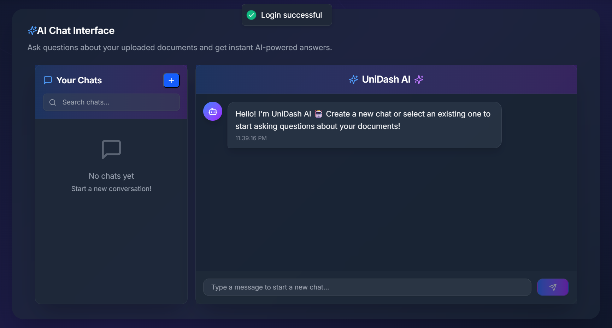
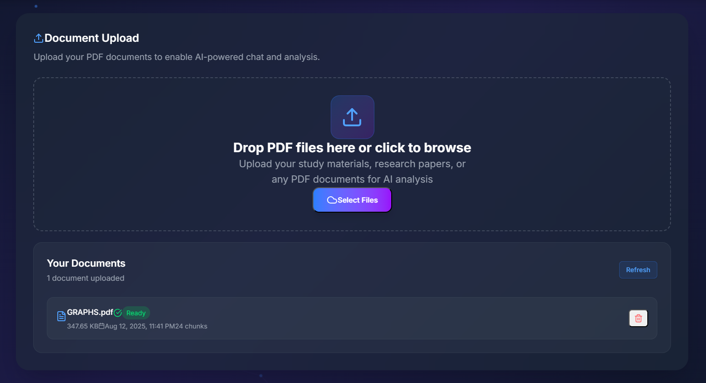
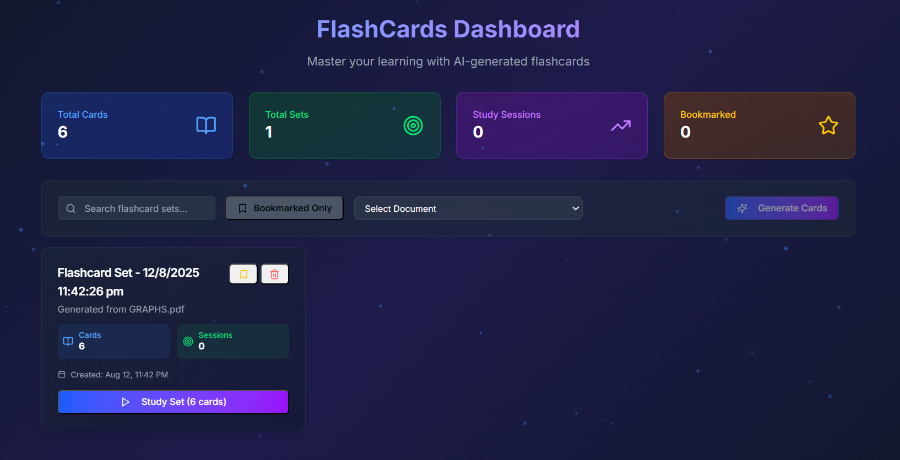
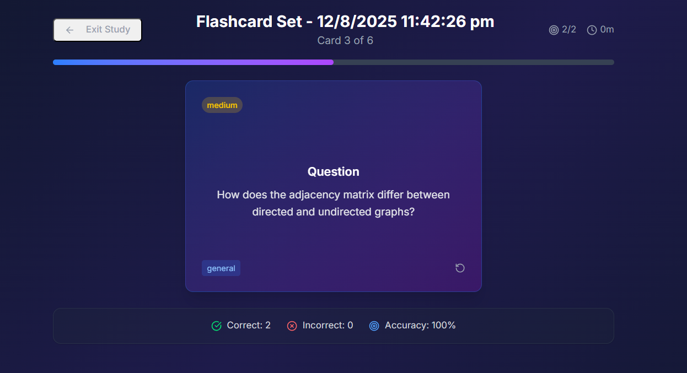
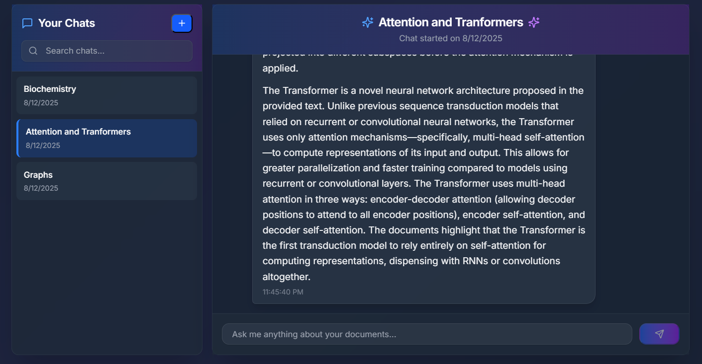
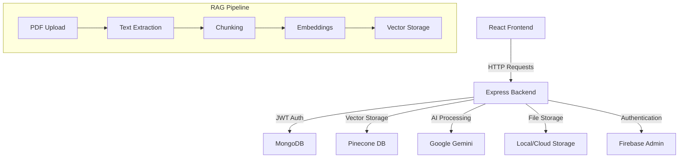

# 🎓 UniDash – AI Study Assistant for Your PDFs

<div align="center">

**Transform Your Study Experience with AI-Powered Document Analysis**

UniDash lets you upload PDFs, chat with an AI that understands your content, and auto‑generate spaced‑repetition flashcards from your documents. It ships with a modern React UI and a Node.js/Express backend powered by MongoDB, LangChain, Gemini, and Pinecone.

[](https://reactjs.org/)
[](https://nodejs.org/)
[](https://expressjs.com/)
[](https://www.mongodb.com/)
[](https://www.langchain.com/)
[](https://ai.google.dev/)
[](https://www.pinecone.io/)


</div>

---

## 🌟 Overview

UniDash is an intelligent study assistant that revolutionizes how students interact with their academic materials. Upload PDFs, chat with AI that understands your content, and auto-generate spaced-repetition flashcards from your documents. Built with modern technologies and powered by advanced RAG (Retrieval Augmented Generation) capabilities.

### 🎯 Key Highlights

- **🧠 AI Chat Interface**: Ask questions about your documents and get instant, contextual answers
- **📄 PDF Processing**: Advanced document parsing, chunking, and vector storage
- **🎴 Smart Flashcards**: AI-generated flashcards with spaced repetition and progress tracking
- **🔐 Secure Authentication**: JWT-based auth with Firebase integration
- **⚡ Lightning Fast**: Optimized RAG system with real-time responses
- **🎨 Beautiful UI**: Modern design with Tailwind CSS and Framer Motion

---

## ✨ Features
###  Landing Page


### 🤖 AI-Powered Document Analysis
Transform your study materials into an interactive learning experience. Our advanced RAG system understands context and provides accurate, grounded responses from your uploaded documents.


*Interactive chat interface with contextual responses from your documents*

### 📚 Document Management
Upload and manage your academic PDFs with ease. Support for research papers, textbooks, lecture notes, and more with automatic processing and indexing.


*Drag-and-drop interface with real-time processing status*

### 🎴 Intelligent Flashcard Generation
Automatically generate high-quality flashcards from your documents using AI. Features include:
- **Smart Content Extraction**: AI identifies key concepts and definitions
- **Difficulty Levels**: Easy, medium, and hard questions
- **Spaced Repetition**: Optimized review scheduling
- **Progress Tracking**: Detailed analytics and performance metrics


*AI-powered flashcard creation from document content*

### 📊 Study Mode & Analytics
Comprehensive study experience with interactive flashcards, progress tracking, and detailed statistics to optimize your learning.


*Interactive study interface with flip animations and progress tracking*

### 💬 Chat History & Management
Organize your conversations with document-specific chat sessions, search functionality, and conversation management.


*Chat history with search and organization features*

### 🔐 Secure Authentication
Multi-layered security with JWT tokens, HTTP-only cookies, and Firebase integration for Google Sign-In.


*Secure login interface with multiple authentication options*


## 🛠️ Tech Stack

### Frontend
- **React 19** - Modern UI library with latest features
- **Vite 7** - Lightning-fast build tool and dev server
- **Tailwind CSS 4** - Utility-first CSS framework
- **Framer Motion 12** - Production-ready motion library
- **React Router 7** - Declarative routing
- **TanStack Query 5** - Powerful data fetching
- **Radix UI** - Accessible component primitives
- **Lucide Icons** - Beautiful icon library

### Backend
- **Node.js** - JavaScript runtime environment
- **Express 5** - Fast, minimalist web framework
- **MongoDB** - NoSQL database with Mongoose ODM
- **JWT** - Secure authentication tokens
- **Multer** - File upload handling
- **CORS** - Cross-origin resource sharing

### AI & Machine Learning
- **LangChain** - Framework for developing AI applications
- **Google Gemini AI** - Advanced language model for chat and embeddings
- **Pinecone** - Vector database for semantic search
- **RAG (Retrieval Augmented Generation)** - Context-aware AI responses

### Authentication & Security
- **JWT (JSON Web Tokens)** - Stateless authentication
- **Firebase Admin** - User management and Google Sign-In
- **HTTP-Only Cookies** - Secure token storage
- **CORS Protection** - Cross-origin request security

---

## 🏧 Architecture

UniDash follows a modern full-stack architecture with clear separation of concerns:



### Data Flow

1. **Document Processing**: PDFs are uploaded, parsed, chunked, and converted to embeddings
2. **Vector Storage**: Embeddings stored in Pinecone with user-specific namespaces
3. **Query Processing**: User questions are embedded and used for similarity search
4. **Response Generation**: Relevant context is passed to Gemini AI for response generation
5. **Flashcard Creation**: AI analyzes document content to generate educational flashcards


## Folder Structure

```text
UniDash/
  client/                 # React app (Vite)
    src/
      Api/               # Axios wrappers for backend endpoints
      components/        # Reusable UI (Chat, Upload, Flashcards, etc.)
      contexts/          # Auth context
      pages/             # Route pages: home, login, signup, dashboard, flashcards
      firebase.js        # Client Firebase config (used for Google sign-in)
    package.json
    vite.config.js

  server/                 # Express API
    controllers/          # Route handlers
      authController.js
      userController.js
      uploadController.js
      queryController.js
      firebaseController.js
      chatController.js
      messageController.js
      flashCardController.js
      flashCardSetController.js
    models/               # Mongoose schemas
      user.js
      Document.js
      Chat.js
      Message.js
      FlashCard.js
      FlashCardSet.js
    config/               # Integrations
      dbconfig.js         # Mongo connection
      firebaseAdmin.js    # Firebase Admin init (service account)
      pinecone.js         # Pinecone init + index helpers
    utils/
      langchain.js        # RAG service: PDF -> chunks -> embeddings -> Pinecone; query + flashcards
    app.js                # Express middleware + route mounting
    server.js             # Server bootstrap + Pinecone init + uploads dir
    uploads/              # Uploaded PDFs (local dev)
    package.json
```


## How It Works (Architecture)

1. Upload a PDF
   - `uploadController` stores the file and a `Document` record
   - `RAGService.processDocument` loads PDF, splits into chunks, creates Gemini embeddings, and stores them in Pinecone (namespaced per user)

2. Ask a question in Chat
   - Client posts `/api/query` with `{ query, userId }`
   - `RAGService.queryDocuments` retrieves top‑K chunks from Pinecone, constructs a prompt, invokes Gemini chat, and returns a grounded answer with quick source previews
   - The conversation is stored as `Message` items linked to a `Chat`

3. Generate Flashcards
   - Client posts `/api/flashcards/generate` with `{ documentId, userId }`
   - `RAGService.generateFlashCards` selects diverse chunks, prompts LLM, regex‑parses Q/A pairs, validates and saves to `FlashCard`
   - A `FlashCardSet` is automatically created with the generated cards

4. Study Mode
   - Interactive flipping cards, correctness tracking, spaced‑repetition stats, and study session logging per `FlashCardSet`


## 🚀 Quick Start

### Prerequisites

- **Node.js** (v18 or higher)
- **MongoDB** (local or cloud instance)
- **Google AI API Key** (for Gemini AI)
- **Pinecone Account** (for vector storage)
- **Firebase Project** (optional, for Google Auth)

### 1. Clone the Repository

```bash
git clone https://github.com/yourusername/unidash.git
cd unidash
```

### 2. Backend Setup

```bash
cd server
npm install
```

Create `.env` file in the server directory:

```env
# Server Configuration
PORT=4000
NODE_ENV=development

# Database
MONGO_URL=mongodb://localhost:27017/unidash

# Authentication
JWT_SECRET=your_super_secret_jwt_key_here

# AI & Vector Database
GOOGLE_API_KEY=your_google_ai_api_key
PINECONE_API_KEY=your_pinecone_api_key
PINECONE_INDEX_NAME=unidash-index

# File Upload
UPLOAD_DIR=uploads
MAX_FILE_SIZE=10485760
```

### 3. Frontend Setup

```bash
cd ../client
npm install
```

### 4. Firebase Setup (Optional)

1. Create a Firebase project at [Firebase Console](https://console.firebase.google.com/)
2. Enable Authentication with Google Sign-In
3. Download service account key and place it at `server/config/firebaseServiceAccountKey.json`
4. Update `client/src/firebase.js` with your Firebase config

### 5. Pinecone Setup

1. Create account at [Pinecone](https://www.pinecone.io/)
2. Create a new index with:
   - **Dimensions**: 768 (for Gemini embeddings)
   - **Metric**: cosine
   - **Environment**: as per your plan

### 6. Run the Application

**Backend** (Terminal 1):
```bash
cd server
npm start
```

**Frontend** (Terminal 2):
```bash
cd client
npm run dev
```

### 7. Access the Application

- **Frontend**: http://localhost:5173
- **Backend API**: http://localhost:4000


## Install & Run

```bash
# 1) Backend
cd server
npm install
npm start

# 2) Frontend (new terminal)
cd ../client
npm install
npm run dev

# App
# Frontend: http://localhost:5173
# Backend:  http://localhost:4000
```

Vite dev server proxies API calls to `http://localhost:4000` (see `client/package.json`). CORS in `server/app.js` allows `http://localhost:5173` and `http://localhost:5174`.


## API Overview

Base URL: `/api`

### Auth
- `POST /auth/signup` – email/password signup
- `POST /auth/login` – email/password login, sets JWT cookie
- `POST /auth/logout` – clears JWT cookie
- `POST /firebase-login` – login with Firebase ID token (sets JWT cookie)

### User
- `GET /user/get-logged-user` – returns current user (JWT required)
- `PUT /user/update-profile` – update `firstname`, `lastname` (JWT required)

### Documents & Uploads
- `POST /upload` – multipart upload: field `file` (PDF), body `userId`
- `GET /documents/:userId` – list user documents (no file paths exposed)
- `DELETE /documents/:documentId` – delete a document (body `userId`)
- `DELETE /documents/:userId` – delete all vectors for user from Pinecone (body `{ confirmDelete: true }`)

### Query (RAG)
- `POST /query` – `{ query, userId }` → grounded answer and quick source previews
- `GET /stats/:userId` – vector stats (`totalVectors`) for the user namespace

### Chats
- `GET /chats/:userId` – list chats (pagination)
- `GET /chats/:userId/stats` – totals for chats/messages/queries + recent activity
- `GET /chats/:userId/:chatId` – fetch a chat
- `POST /chats` – create chat `{ userId, name, description? }`
- `PUT /chats/:chatId` – update chat `{ userId, name?, description? }`
- `DELETE /chats/:chatId` – delete chat and all messages (body `userId`)

### Messages
- `GET /messages/:chatId` – list messages (pagination)
- `POST /messages` – create message `{ chatId, userId, content, role, messageType?, metadata? }`
- `DELETE /messages/:messageId` – delete a message (body `userId`)
- `GET /messages/search/:userId` – search by content (optional `chatId`)

### Flashcards
- `GET /flashcards/health` – health check
- `POST /flashcards/generate` – `{ documentId, userId, options? }` → creates 1 set with up to 6 cards
- `GET /flashcards/user/:userId` – list user cards (filters, pagination)
- `GET /flashcards/stats/:userId` – aggregated stats (accuracy, totals, distribution)
- `GET /flashcards/:cardId?userId=...` – fetch a card
- `PUT /flashcards/:cardId` – update a card (Q/A, tags, difficulty, bookmark)
- `DELETE /flashcards/:cardId` – soft delete
- `POST /flashcards/:cardId/review` – record a review `{ userId, isCorrect, responseTime }`

### Flashcard Sets
- `POST /flashcard-sets` – create set
- `GET /flashcard-sets/user/:userId` – list sets (filters, pagination)
- `GET /flashcard-sets/:setId?userId=...` – fetch a set
- `PUT /flashcard-sets/:setId` – update set (name, description, tags, settings, bookmark)
- `POST /flashcard-sets/:setId/cards` – add cards to set
- `DELETE /flashcard-sets/:setId/cards` – remove cards from set
- `DELETE /flashcard-sets/:setId` – soft delete set
- `POST /flashcard-sets/:setId/study-session` – log study session summary


## Data Models (MongoDB)

- `Users` – profile and email/password hash (password optional if logging in via Firebase)
- `Document` – upload metadata and processing status
- `Chat` – chat sessions per user
- `Message` – message items linked to chats (role: user/assistant)
- `FlashCard` – question/answer, difficulty, review stats
- `FlashCardSet` – collection of cards, tags, study settings, and set‑level stats

## Quick API Examples

```bash
# Login
curl -X POST http://localhost:4000/api/auth/login \
  -H "Content-Type: application/json" \
  -d '{"email": "user@example.com", "password": "secret"}' -i

# Upload a PDF
curl -X POST http://localhost:4000/api/upload \
  -F "file=@/path/to/file.pdf" \
  -F "userId=USER_ID"

# Ask a question
curl -X POST http://localhost:4000/api/query \
  -H "Content-Type: application/json" \
  -d '{"query": "Explain attention", "userId": "USER_ID"}'

# Generate flashcards for a document
curl -X POST http://localhost:4000/api/flashcards/generate \
  -H "Content-Type: application/json" \
  -d '{"documentId":"DOC_ID","userId":"USER_ID"}'
```

## 🔐 Security Features

### Authentication & Authorization
- **JWT Tokens**: Stateless authentication with HTTP-only cookies
- **Password Hashing**: bcrypt with salt rounds
- **Route Protection**: Middleware-based access control
- **CORS Configuration**: Restricted cross-origin requests

### Privacy
- **User Data Isolation**: Namespace-based vector storage
- **Secure File Storage**: Protected upload directory
- **Session Management**: Automatic token expiration

---

## 📜 License

This project is licensed under the MIT License - see the [LICENSE](LICENSE) file for details.

---
</div>
